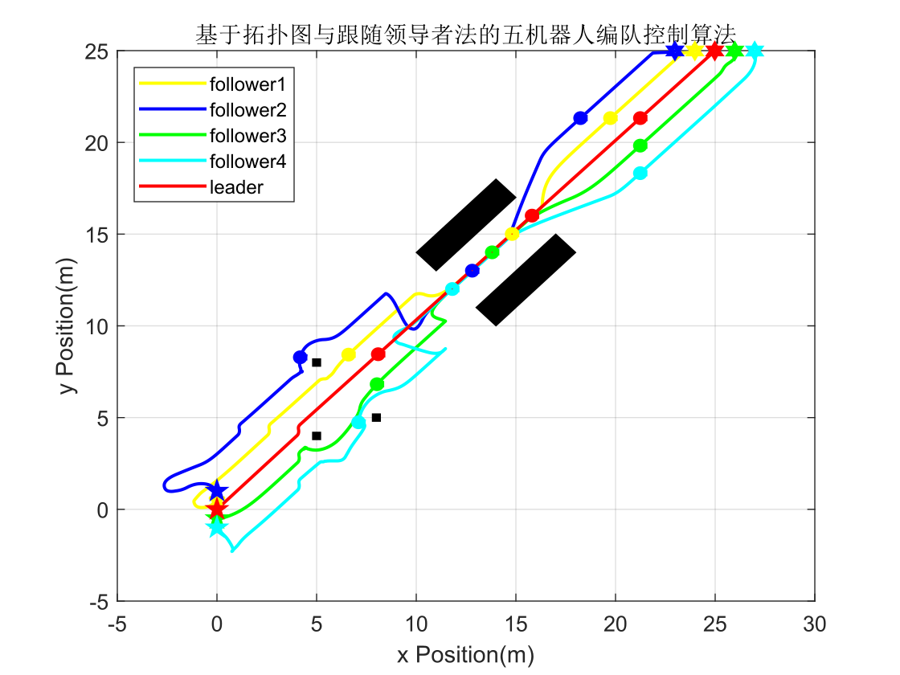
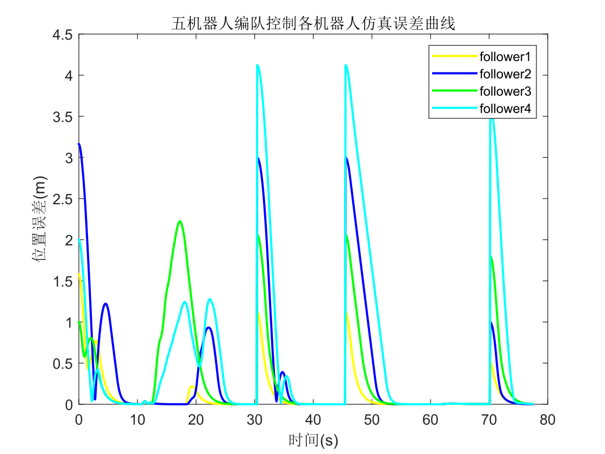

# **Formation Control of Five Robots**_Matlab

## Environment：

matlab2020a

Win10/11

## Method：

**Add `subfunc`: Open MATLAB, right-click on `subfun` → `Add to Path` → `Selected Folder and Subfolders`**

**Then run** `demo1.m demo2.m demo3.m`

## **Performance** ：

